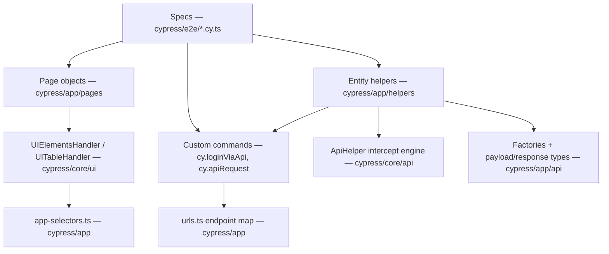

# Architecture

Read once — this is the _why_ behind the folder layout. The _how-to_ lives in [ADDING-A-FEATURE-TEST.md](ADDING-A-FEATURE-TEST.md).

## The layers



## Import aliases

Cross-layer imports always use the two aliases defined in `cypress/tsconfig.json` (`paths`) and resolved at runtime by the webpack preprocessor wired in `cypress.config.ts`:

- `@core/*` → `cypress/core/*` — the engine
- `@app/*` → `cypress/app/*` — your layer

Because aliased imports never depend on folder depth, specs and app files can be nested into feature folders freely (and `npm run scaffold -- <group>/<name>` does exactly that). Relative imports are used only _within_ a layer (e.g. core file → core file, or between files the scaffold generates side by side).

## One test, traced

`cypress/examples/specs/table-example.cy.ts` EX-4, through every layer:

1. The spec builds an `ITableValidationPair` — `identifiers` say which row (`Last Name = Bach`), `data` says what the other cells must contain.
2. It calls `ExampleTablesPage.verifyRecords([...])` — the **page object** knows the table's selector and header names, nothing else.
3. The page object delegates to `UITableHandler.verifyTableRecord` — the **core engine** maps header texts to column indexes, finds the row matching all identifiers, and asserts each cell.
4. Before touching the table, the handler calls `UIElementsHandler.waitForLoaderToDisappear()` — which reads `AppSelectors.loaderSelector` from **your app config** (a no-op until you set it).

The same shape applies to actions: spec → `FeaturePage.clickAddButton()` → `UIElementsHandler.clickButton(locator)`.

## Layer contracts

| Layer                                     | May import from                                                    | Must never                                                                         |
| ----------------------------------------- | ------------------------------------------------------------------ | ---------------------------------------------------------------------------------- |
| `cypress/core`                            | core, `@app/app-selectors` only                                    | know about pages, specs, or your endpoints                                         |
| `cypress/app` (pages, api, helpers, urls) | `@core`, `@app`                                                    | interact with elements directly in a page object — always delegate to the handlers |
| `cypress/e2e` specs                       | `@app`, `@core` (except `@core/ui` handlers — see below), commands | hardcode selectors, URLs, or `cy.wait(milliseconds)`                               |
| `cypress/support/commands`                | `@core`, `@app` (except `@app/helpers`)                            | contain feature-specific logic — commands are app-wide primitives                  |

`app-selectors.ts` is the single sanctioned inversion: it is the configuration contract the core reads so the engine stays framework-agnostic.

**These contracts are enforced by ESLint** (`no-restricted-imports` blocks in `eslint.config.mjs`), not just documented:

- `cypress/core` importing anything from `@app` other than `@app/app-selectors` is a lint **error**.
- Specs (`cypress/e2e`, `cypress/examples/specs`, `cypress/templates/specs`) importing `@core/ui/*` is a lint **error** — element access belongs to page objects. The one exception is `@core/ui/table-types` (`ITableValidationPair`/`ColumnValuePair`), which specs need to _describe_ expectations without _driving_ elements.
- `cypress/support` importing `@app/helpers/*` is a lint **error** — entity helpers build on commands (`cy.apiRequest`), so that dependency may never flow backwards. Support may import app types (`ILoginResponse`) and pages (`cy.loginViaForm` drives `LoginPage`), matching the table above.
- Specs and page objects calling `cy.get`, `cy.request`, or `cy.intercept` **directly** is a lint **error** (`no-restricted-syntax`) — those raw primitives bypass the handler layer. Specs act through page objects; page objects delegate to `UIElementsHandler`/`UITableHandler`; API traffic goes through `ApiHelper`/`cy.apiRequest`. Only `cypress/core` and `cypress/support` may hold the raw primitives.

### What "no direct cy calls" means in a page object

The rule bans direct **element interaction** — `cy.get`, `cy.contains`, `.click()`, `.type()` chains belong in `UIElementsHandler`/`UITableHandler`, so timeout policy, loader waits and logging stay in one place; `cy.get`/`cy.request`/`cy.intercept` are lint-banned outside the handler layer to make this non-negotiable. Browser-level reads that have no element handler — `cy.url()`, `cy.window()`, `cy.location()` — are fine in a page object (see `ExampleSecurePage.verifyLoggedIn`). If you need an _element_ interaction the handlers don't cover, extend the handler (a framework change), don't inline `cy.get`.

Page objects also carry their page's `verify*` methods. That is a deliberate choice, not a leak: assertions still run inside the core verifiers (`verifyElementText`, `verifyTableRecord`, ...) — the page object only names them after the page's domain so specs read declaratively.

## Accessibility scans

`cypress-axe` is registered in `cypress/support/e2e.ts` and gated behind one flag on the single navigation funnel. `Navigator.visitUrl(url, { a11y: true })` waits for the loader to settle, then `cy.injectAxe()` + `cy.checkA11y()` — so every page inherits accessibility coverage through the same seam it already uses to visit, with no spec or page-object changes. It is off by default (opt in per visit as you drive violations to zero); scope or tune a scan with the `a11yContext` / `a11yOptions` fields on `IVisitOptions`. This is the same "centralize the cross-cutting concern at the funnel" move the loader-wait and API-wait already use.

## Parallel execution

`cypress-split` is wired in `cypress.config.ts` (`setupNodeEvents`) and shards the spec list when `SPLIT` / `SPLIT_INDEX` are set — the CI matrix runs N containers, each taking an even slice, and their Allure results merge into one report. Locally the variables are unset, so `npm test` runs the whole suite in one process. Independent specs (no cross-spec state; `cy.session` for login) are what make this safe.

## Folder conventions at scale

- **Specs**: group by feature domain once you pass a handful of files — `cypress/e2e/<domain>/<feature>.cy.ts`. The scaffold does it for you: `npm run scaffold -- shop/product` writes `cypress/e2e/shop/product.cy.ts` and nests the page/factory/helper the same way. Aliased imports make flat and nested files identical otherwise.
- **Fixtures**: mirror the feature domains — `cypress/fixtures/<feature>/<entity>.json`. Keep one entity shape per file; load sections via `FixtureUtils.loadFixtureData` and read them with `FixtureUtils.getFixtureValue`. The data lands in the `Cypress.expose('fixtures')` namespace — **not** the deprecated `Cypress.env()` — and never among the env values, which belong to the environment files / `ENV_KEY`.
- **Spec filenames**: `<feature>.cy.ts` — the `.cy.ts` extension already marks a spec, so no `-spec` suffix.

## Environment loading

`npx cypress run --env version=<name>` (default `demo`) makes `cypress.config.ts`:

1. Read `config/environments/<name>.json`. Top-level keys (`baseUrl`, `apiBaseUrl`, ...) merge into `Cypress.config()`; the nested `"env"` block becomes the suite's env values (`username`, `password`, ...).
2. If `config/environments/<name>.db.js` exists, load the SQL Server plugin ([DB module](DATABASE-MODULE.md)); otherwise register a fail-fast stub.

Custom config keys you add (like `apiBaseUrl`) are typed once in `cypress/support/index.d.ts` — never use `@ts-ignore` to read config.

### Reading env values in specs

The synchronous `Cypress.env()` is deprecated in browser code and will be removed in a future Cypress major, so the template never calls it — **enforced by lint** (`no-restricted-properties` in `eslint.config.mjs`). Instead:

- **Env values** (credentials, per-environment settings) are read with the async `cy.env` command, always through the `ENV_KEY` enum:

  ```ts
  cy.env<Record<ENV_KEY, string>>([ENV_KEY.username, ENV_KEY.password]).then((credentials) => {
    cy.loginViaApi(credentials[ENV_KEY.username], credentials[ENV_KEY.password])
  })
  ```

- **Runtime shared data** (fixture sections, reference-data caches) lives in `Cypress.expose(...)` — the sanctioned synchronous browser-side store. `FixtureUtils` namespaces fixture data under `Cypress.expose('fixtures')` (loaded with `FixtureUtils.loadFixtureData`, read with `FixtureUtils.getFixtureValue`) — never the deprecated `Cypress.env()`.

One loose end is out of our hands: `allowCypressEnv` (the runtime switch that hard-disables `Cypress.env()` in the browser) stays at its default because allure-cypress (≤ 3.10.2) still reads `Cypress.env('allure')` at import time. Template code is already clean — set `allowCypressEnv: false` in `cypress.config.ts` as soon as allure-cypress migrates.

### Credential safety in screenshots

`cy.loginViaForm` types real credentials into the UI, and `screenshotOnRunFailure` is on — so a failure on the login page could capture the password in a CI artifact. To prevent that, `loginViaForm` sets `Cypress.Screenshot.defaults({ blackout: [AppSelectors.passwordFieldSelector] })`, blacking out **only** the password field (default `input[type="password"]`) while leaving the rest of the page visible for debugging. Widen `AppSelectors.passwordFieldSelector` if your app uses a custom/styled control, or set it to `null` to disable the redaction.

## Files you never touch vs files you own

| You never touch                              | You own                                                               |
| -------------------------------------------- | --------------------------------------------------------------------- |
| `cypress/core/**` (handlers, engines, utils) | `cypress/app/**` (app-selectors, urls, env-keys, pages, api, helpers) |
| `cypress/support/commands/api-commands.ts`   | `cypress/support/commands/auth-commands.ts` (your login)              |
| `cypress/support/commands/db-commands.ts`    | `cypress/e2e/**` (your specs)                                         |
| `cypress/templates/**` (scaffold sources)    | `config/environments/local.json` (your machine, gitignored)           |

When the engine genuinely needs a change, treat it like a framework PR: everyone's tests depend on it.

## The example / template pairing

Every pattern exists twice on purpose:

- `cypress/examples/**` — **runnable** proof against the bundled local demo app (`npm test`); read these to see a pattern working.
- `cypress/templates/**` — **fill-in** skeletons with `TODO(template)` markers; the scaffold copies these for your features. They are type-checked on every `npm run typecheck` but excluded from `specPattern`, so they never pollute the runner.

Template files carry a `.template.ts` / `.template.cy.ts` marker in their names — with one deliberate exception: the type skeletons (`feature-payload.d.ts`, `feature-response.d.ts`) stay plain `.d.ts`, because a `.template.d.ts` name would stop TypeScript from treating them as declaration files. The scaffold renames both kinds the same way.
